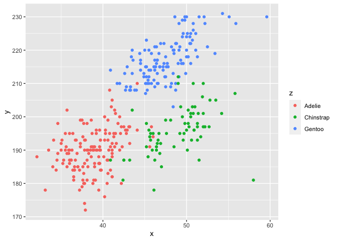

Homework1
================
Jyoti Kumar

This is my R Markdown File for Homework1

``` r
library(tidyverse)
```

    ## ── Attaching packages ──────────────────────────────────────────────────────────────────────── tidyverse 1.3.0 ──

    ## ✓ ggplot2 3.3.2     ✓ purrr   0.3.4
    ## ✓ tibble  3.0.3     ✓ dplyr   1.0.2
    ## ✓ tidyr   1.1.2     ✓ stringr 1.4.0
    ## ✓ readr   1.3.1     ✓ forcats 0.5.0

    ## ── Conflicts ─────────────────────────────────────────────────────────────────────────── tidyverse_conflicts() ──
    ## x dplyr::filter() masks stats::filter()
    ## x dplyr::lag()    masks stats::lag()

## Problem 1

## Creating a data frame

``` r
prob1_df =  
   tibble(
    samp = rnorm(10),
    samp_gt_0 = samp > 0,
    char_vec = c("a", "b", "c", "d", "e", "f", "g", "h", "i", "j"),
    factor_vec = factor(c("low","low","low","mod", "mod", "mod", "mod", "high", "high", "high")),
    )
```

Taking the mean of each variable in the data frame.

``` r
mean(pull(prob1_df,samp))
```

    ## [1] -0.06346706

``` r
mean(pull(prob1_df, samp_gt_0))
```

    ## [1] 0.4

``` r
mean(pull(prob1_df, char_vec))
```

    ## Warning in mean.default(pull(prob1_df, char_vec)): argument is not numeric or
    ## logical: returning NA

    ## [1] NA

``` r
mean(pull(prob1_df, factor_vec))
```

    ## Warning in mean.default(pull(prob1_df, factor_vec)): argument is not numeric or
    ## logical: returning NA

    ## [1] NA

We can take the mean of numbers and logical terms but not of characters
and factors.

``` r
as.numeric(pull(prob1_df,samp))
```

    ##  [1]  0.24314017 -0.78072232 -1.07720341  1.26568108 -0.34921845  0.23749269
    ##  [7] -0.11578012  0.37498877 -0.08648244 -0.34656660

``` r
as.numeric(pull(prob1_df, samp_gt_0))
```

    ##  [1] 1 0 0 1 0 1 0 1 0 0

``` r
as.numeric(pull(prob1_df, char_vec))
```

    ## Warning: NAs introduced by coercion

    ##  [1] NA NA NA NA NA NA NA NA NA NA

``` r
as.numeric(pull(prob1_df, factor_vec))
```

    ##  [1] 2 2 2 3 3 3 3 1 1 1

``` r
as.numeric(pull(prob1_df,samp_gt_0)) * pull(prob1_df,samp)
```

    ##  [1] 0.2431402 0.0000000 0.0000000 1.2656811 0.0000000 0.2374927 0.0000000
    ##  [8] 0.3749888 0.0000000 0.0000000

``` r
(pull(prob1_df, factor_vec)) * pull(prob1_df, samp)
```

    ## Warning in Ops.factor((pull(prob1_df, factor_vec)), pull(prob1_df, samp)): '*'
    ## not meaningful for factors

    ##  [1] NA NA NA NA NA NA NA NA NA NA

``` r
as.numeric(pull(prob1_df, factor_vec)) * pull(prob1_df, samp)
```

    ##  [1]  0.48628034 -1.56144465 -2.15440683  3.79704324 -1.04765536  0.71247808
    ##  [7] -0.34734037  0.37498877 -0.08648244 -0.34656660

We can multiply numeric data with the random sample but not factors.

## Problem 2

``` r
data( "penguins", package = "palmerpenguins")
```

``` r
summary(penguins)
```

    ##       species          island    bill_length_mm  bill_depth_mm  
    ##  Adelie   :152   Biscoe   :168   Min.   :32.10   Min.   :13.10  
    ##  Chinstrap: 68   Dream    :124   1st Qu.:39.23   1st Qu.:15.60  
    ##  Gentoo   :124   Torgersen: 52   Median :44.45   Median :17.30  
    ##                                  Mean   :43.92   Mean   :17.15  
    ##                                  3rd Qu.:48.50   3rd Qu.:18.70  
    ##                                  Max.   :59.60   Max.   :21.50  
    ##                                  NA's   :2       NA's   :2      
    ##  flipper_length_mm  body_mass_g       sex           year     
    ##  Min.   :172.0     Min.   :2700   female:165   Min.   :2007  
    ##  1st Qu.:190.0     1st Qu.:3550   male  :168   1st Qu.:2007  
    ##  Median :197.0     Median :4050   NA's  : 11   Median :2008  
    ##  Mean   :200.9     Mean   :4202                Mean   :2008  
    ##  3rd Qu.:213.0     3rd Qu.:4750                3rd Qu.:2009  
    ##  Max.   :231.0     Max.   :6300                Max.   :2009  
    ##  NA's   :2         NA's   :2

## The data set includes the palmer penguins dataset includes the following:

The species and the island they are from, the bill length and depth in
mm, the flipper length in mm, body mass, sex and their year. The data
has 344 rows and The data has 8 columns. The mean flipper length is
200.9 mm

# Plotting bill\_length\_mm vs flipper\_length\_mm

``` r
library(tidyverse)
penguins_df = tibble(
  x = (penguins$bill_length_mm),
  y = (penguins$flipper_length_mm),
  z = (penguins$species)
)
ggplot(penguins_df, aes(x = x, y = y, color = z)) + geom_point()
```

    ## Warning: Removed 2 rows containing missing values (geom_point).

<!-- -->

``` r
ggsave("scatter_plot.pdf")
```

    ## Saving 7 x 5 in image

    ## Warning: Removed 2 rows containing missing values (geom_point).
